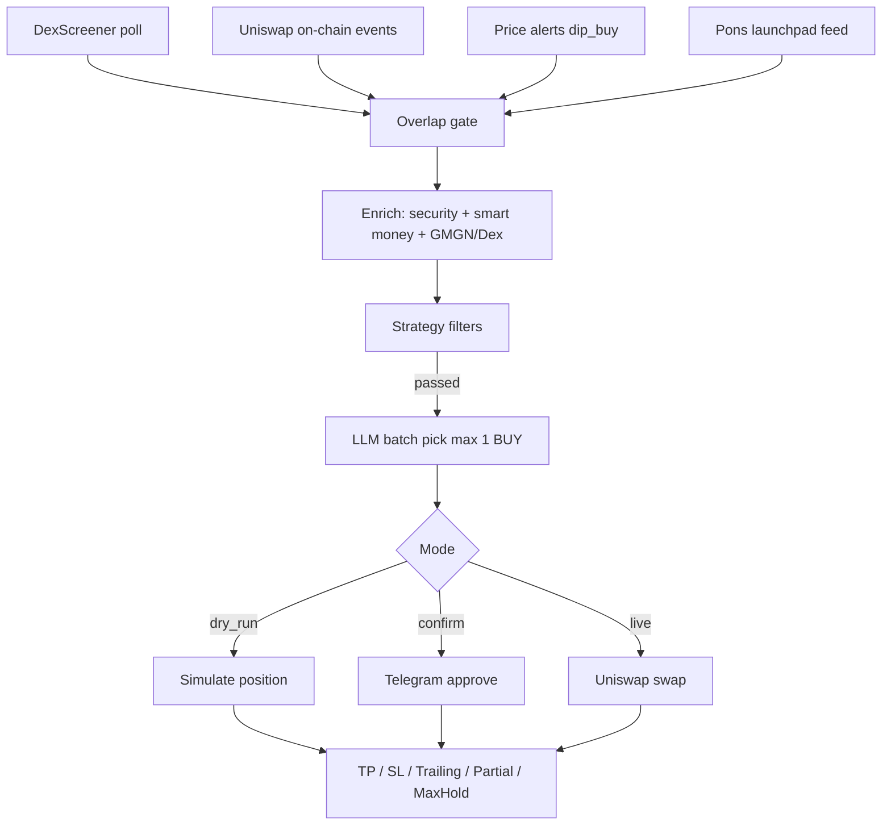
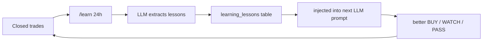

# Charon-RH

Charon-style trench agent for **meme tokens on Robinhood Chain** (EVM L2, chainId **4663**).

Adapted from [yunus-0x/charon](https://github.com/yunus-0x/charon) (Solana / Pump.fun) to EVM:

| Charon (Solana) | Charon-RH (Robinhood L2) |
|---|---|
| Pump.fun fee-claim WS | Volume spikes + on-chain Uniswap Swap activity |
| Graduated tokens | New Uniswap pools / fresh pairs |
| Trending feed | DexScreener trending/search |
| GMGN enrichment | Blockscout holders + concentration |
| Jupiter Ultra | Uniswap V3 SwapRouter02 |
| SOL reserve | ETH reserve |
| SQLite + Telegram | SQLite + Telegram (same UX) |

> ⚠️ **Testing period.** No performance guarantees. Meme tokens are extremely high risk. Start in `dry_run`.

---

## Flow



## Strategies

| id | Entry | Focus | TP / SL | LLM |
|---|---|---|---|---|
| `sniper` | immediate | overlap ≥2 + volume spike + early pool | +50% / −25% trailing 20% | on |
| `dip_buy` | wait_for_dip | buy −35% dip alerts | +30% / −20% trailing 15% | on |
| `smart_money` | immediate | holders ≥200, top10 ≤45%, partial TP | +100% / −25% partial 50%@100% | on |
| `degen` | immediate | loose, rule-based | +30% / −15% trailing 10% | **off** |

Activate: Telegram `/strategy <id>` or `/menu`.

## Install

```bash
cd charon-rh
npm install
cp .env.example .env
# edit .env
npm start
```

### Required env

```
TELEGRAM_BOT_TOKEN=
TELEGRAM_CHAT_ID=
```

### Recommended

```
TRADING_MODE=dry_run
ENABLE_LLM=true
LLM_API_KEY=sk-...
LLM_MODEL=gpt-4o-mini
RPC_URL=https://rpc.mainnet.chain.robinhood.com
```

### Live trading (use at your own risk)

```
TRADING_MODE=live   # or confirm for human-in-the-loop
PRIVATE_KEY=0x...
LIVE_MIN_ETH_RESERVE=0.005
SLIPPAGE_BPS=300
```

---

## Telegram commands

```
/menu              interactive settings (Strategy / Mode / Status / PnL)
/status            mode + strategy + open positions
/strategy          list / activate strategies
/stratset <id> <key> <value>
                   hot-edit any strategy parameter (no restart)
                   e.g. /stratset sniper tp_percent 75
/positions         open + closed (entry/exit USD price + CA)
/pnl               win rate + net ETH
/pnlcard [YYYY-MM-DD]
                   daily PnL card PNG (1200×675) ready for X / Twitter
/pnlcard text [YYYY-MM-DD]
                   copy-paste text card for X
/failures          last 8 rejected candidates + why
/filters           active thresholds
/learn [1h|24h|7d] LLM analyze closed trades → store lessons
/lessons           list active lessons
/lessondel <id>    delete a lesson
/wallets           list tracked smart wallets
/walletadd <label> <0x…>
/walletremove <label>
/security <0x mint>  rug/honeypot check
/intents           pending confirm trades
/confirm <id>      approve live buy
/reject  <id>      reject
/mode dry_run|confirm|live
/enable on|off     toggle auto-buy
/cancel            abort pending interactive edit
```

### `/menu → Strategy` (Charon parity)

Inline keyboard flow:

1. `/menu` → **Strategy**
2. Pick `sniper` / `dip_buy` / `smart_money` / `degen`
3. See current card + quick-edit buttons (TP, SL, trailing, size, max pos, LLM conf…)
4. **Activate** or tap a field to edit

**Interactive edit** (no typing `/stratset` needed):

- Tap a numeric/enum field → bot prompts → type the new value → saved immediately
- Tap a bool field → toggles instantly (on/off)
- `/cancel` aborts a pending prompt (TTL 3 minutes)

`/stratset <id> <key> <value>` still works for the full key list (26 fields).

All edits write to SQLite `strategies.config_json` and are **hot-read** by
`activeStrategy()` — next candidate uses the new values immediately.

---

## Example Telegram sessions

### 1. First boot & status

```
You:  /status
Bot:  Charon-RH status
      Mode: dry_run
      Strategy: sniper (Sniper)
      Open positions: 0/3
      Agent: ON
      GMGN: off → DexScreener + Blockscout
```

### 2. Browse menu → edit a strategy interactively

```
You:  /menu
Bot:  Charon-RH menu
      [📊 Status]  [🎯 Strategy]
      [⚙️ Mode]    [📈 Positions]
      [🔍 Filters] [💰 PnL]
      [🤖 Agent on/off]

You:  (tap 🎯 Strategy)
Bot:  ▶️ sniper — Sniper
        Entry: immediate · sources ≥ 2 + vol spike
        Mcap: $5.0k–$500.0k · Liq ≥ $5.0k
        Holders ≥ 20 · Top10 ≤ 60% · Rug ≤ 0.5
        TP 50% / SL -25% · Trail 20%
        Partial: off
        Size 0.05 ETH · Max pos 3
        LLM: on, conf ≥ 50
      [▶️ sniper] [▫️ dip_buy] [▫️ smart_money] [▫️ degen]

You:  (tap ▶️ sniper)
Bot:  (same card + editor buttons)
      [Take profit %: 50] [Stop loss %: -25]
      [Trailing %: 20]    [Position size ETH: 0.05]
      [Max open positions: 3] [LLM min confidence: 50]
      [Min source count: 2]  [Max rug score: 0.5]
      [✅ Activate] [⬅️ Strategies]

You:  (tap "Take profit %: 50")
Bot:  ✏️ Set Take profit %
      Strategy: sniper · key tp_percent
      Current: 50
      Type: num

      Send the new number value.
      Send /cancel to abort.

You:  75
Bot:  ✅ sniper → tp_percent = 75 (was 50)
      Hot-applied.
```

### 3. Bool toggle (instant, no typing)

```
You:  (tap "Trailing %: 20" area → actually tap a bool field)
Bot:  ▶️ sniper — Sniper
        ...
        TP 75% / SL -25% · Trail 20% (off)   ← toggled
      ...
```

Or use the command form:

```
You:  /stratset sniper trailing_enabled false
Bot:  ✅ sniper → trailing_enabled = false
      Applies immediately (hot-read).
```

### 4. Switch strategy + inspect filters

```
You:  /strategy degen
Bot:  Strategy set to degen

You:  /filters
Bot:  Filters — degen
      Sources ≥ 1
      Volume spike: optional
      Mcap: $3.0k – $150.0k
      Liq ≥ $2.0k · Vol24h ≥ $3.0k
      Holders ≥ 5 · Top10 ≤ 80%
      Rug ≤ 0.7
      TP 30% / SL -15% · Trail 10%
      Size 0.02 ETH · Max pos 5
      LLM: off (rule-based)
```

### 5. Dry-run: signal → entry → TP exit

```
Bot:  🧪 Batch #12 screened 4 · verdict BUY (conf 82)
      Best asymmetric: FUSU fresh pool + volume spike + on-chain swaps.

Bot:  🟢 Position opened
      FUSU #3
      Status: open · Mode: dry_run
      Entry: $48.2k mcap · Size: 0.0500 ETH
      PnL: +0.0%

      … (monitor every 10s) …

Bot:  ✅ Position closed TRAILING_TP
      FUSU #3
      Status: closed · Mode: dry_run
      Entry: $48.2k mcap · Size: 0.0500 ETH
      PnL: +61.4%
      Exit: TRAILING_TP
      PnL ETH: +0.0307 ETH
```

### 6. Confirm mode: human-in-the-loop

```
You:  /mode confirm
Bot:  Trading mode set to confirm

Bot:  🟡 Trade intent #7 — awaiting confirmation

      SCROOGE SCROOGE
      Mint: 0x4d4…1bfd
      Signals: volume+new+trending (×3)
      Mcap: $35.8k · Liq: $49.3k · Vol24h: $38.7k
      Holders: 118 · Top10: 27%
      Price: $0.00006650 · Rug: 0.15

      Decision: BUY (conf 78)
      Fresh pool + volume spike, holder distribution healthy.

Bot:  Intent #7: approve live buy?
      [✅ Approve]  [❌ Reject]

You:  (tap ✅ Approve)
Bot:  🟢 Position opened
      SCROOGE #8
      Status: open · Mode: live
      ...
```

Or reject:

```
You:  /reject 7
Bot:  Rejected trade intent #7.
```

### 7. PnL & positions review

```
You:  /pnl
Bot:  PnL summary
      Closed trades: 12
      Win rate: 58.3%
      Net: +0.1840 ETH

You:  /positions
Bot:  Open positions
      SCROOGE #8
      Status: open · Mode: live
      PnL: +12.1%

      Recently closed
      FUSU #3
      PnL: +61.4% · Exit: TRAILING_TP
```

### 8. Abort a pending edit

```
You:  (tapped a field, prompt is open)
You:  /cancel
Bot:  Edit dibatalkan.
```

### 9. Daily PnL card for X / Twitter

```
You:  /pnlcard
Bot:  (sends a 1200×675 PNG)
      📊 Daily PnL card — 2026-09-26
      🟢 **2026-09-26 · CHARON-RH**
      Net PnL: `+54.1%` (+0.0271 ETH)
      Win rate: `60.0%` (3W / 2L)
      Trades: 5 · Open: 0
      Best: FUSU `+61.4%`
      Worst: AGQLX `-25.0%`

      Siap diunggah ke X.

You:  /pnlcard text
Bot:  📋 PnL text card — 2026-09-26
      (pre-formatted block — copy to X)

You:  /pnlcard 2026-09-25
Bot:  (PNG for that specific date)
```

The card is generated by `scripts/render_pnl_card.py` (Pillow) from
`dry_run_positions` closed trades for that UTC day. Covers:

- Net PnL % + ETH
- Win rate (W/L)
- Trades · Open positions
- Best / Worst ticker
- Cumulative PnL sparkline
- Strategy + execution mode
- `not financial advice` footer for X compliance

---

## Enrichment sources (priority order)

| # | Source | What it gives | Cost |
|---|---|---|---|
| 1 | **GMGN OpenAPI** (`chain=robinhood`) | price, mcap, liq, holders, fees, socials | free tier **5 weight** / window |
| 2 | **DexScreener** | pairs, volume, txns, age, price change | free / public |
| 3 | **Blockscout** | holder list, top-10 concentration | free / public |
| 4 | **Security check** (local) | honeypot/mint/owner/proxy/tax | RPC `eth_call` |
| 5 | **Smart money** | saved wallets + sniper/insider | Blockscout holders + transfers |
| 6 | **Pons launchpad** | launch/graduation feed, fixed-supply tokens | free / public |

### Pons launchpad signal

[Pons](https://www.ponsfamily.com/launchpad) is the Robinhood Chain launchpad:
fixed **1B supply**, WETH pool with **LP locked at creation**, graduation threshold.

| API | Purpose |
|---|---|
| `GET /api/pons-launches?limit=100` | launch feed (new + graduated) |
| `GET /api/pons-token/{token}` | token details |
| `GET /api/pons-market/{token}` | market snapshot |

- Factory v1: `0xA5aAb3F0c6EeadF30Ef1D3Eb997108E976351feB`
- Factory v2: `0x7eD598BcEf8bd9Edd8C97A195C6d13f40801EC7e`
- Docs: https://docs.ponsfamily.com/llms.txt

Each fresh launch / graduation becomes a candidate with signal label `pons`
(plus `graduated` when complete) — this is the Charon equivalent of Pump.fun
`fee-claim` + `graduated` overlap.

Env:
```
PONS_ENABLED=true
PONS_POLL_MS=30000
PONS_LOOKBACK_MS=1800000
```

### Security check (`/security 0x…`)

Rug/honeypot enrichment for EVM meme tokens:

- Contract code exists + Blockscout verification
- `owner()` / `getOwner()` mint authority (flags EOA owners)
- Suspicious selectors: `mint`, `blacklist`, `pause`
- Honeypot heuristic via `eth_call` transfer simulation
- Proxy / upgradeability
- Risk score 0..1 → `PASS` / `WARN` / `FAIL`

Strategy gates: `require_security_pass`, `max_security_risk`.

### Smart money tracking

- `/walletadd <label> 0x…` — track a wallet (yours or a whale)
- `/wallets` / `/walletremove <label>`
- Sniper detection: early buyers from first transfers still holding
- Insider heuristic: early buyers with >2% share or clustered buys
- Strategy gates: `min_saved_wallet_holders`, `max_insider_count`, `max_sniper_share_percent`

Optional external APIs (best-effort, may not cover chain 4663):
`fetchGoPlusSecurity`, `fetchHoneypotIs` in `src/enrichment/security.js`.

When GMGN is disabled, out of weight, rate-limited, or errors, the pipeline
**automatically falls back** to DexScreener + Blockscout — same candidate shape,
no crash, no stall.

```env
GMGN_ENABLED=true
GMGN_API_KEY=gmgn_xxx
GMGN_CHAIN=robinhood
GMGN_WEIGHT_BUDGET=5          # free tier
GMGN_WEIGHT_WINDOW_MS=60000   # reset window
GMGN_REQUEST_DELAY_MS=2500    # 1 req / 5s max (official rule)
```

Check current budget from Telegram `/status` or logs at boot.

## Learning loop (LLM)

Charon-RH can learn from its own closed trades and feed lessons back into
future buy decisions.



| Command | What it does |
|---|---|
| `/learn 24h` | Analyze last 24h closed trades with LLM → store 1–5 lessons |
| `/learn 1h` / `6h` / `7d` | Other windows |
| `/lessons` | Show active lessons with evidence |
| `/lessondel <id>` | Remove a lesson |

Example lesson:

```
🔴 SL exits hit avg -28% vs target -15% — widen SL or check price source
   [5/8 SL, avg loss -28%]
```

- **LLM** (OpenAI-compatible: `LLM_BASE_URL` / `LLM_MODEL`) returns strict JSON
  `{lessons:[{lesson, evidence, severity}]}`
- **Fallback** if LLM is off or fails: rule-based lessons from stats
  (win rate, SL ratio, avg loss, net PnL)
- Stored lessons are injected as `recent_lessons` on every LLM batch decision
  (`src/pipeline/llm.js` → `activeLessonsForPrompt`)
- Table: `learning_lessons` in SQLite

Typical cadence: run `/learn 24h` once a day after a dry-run session.

## Overlap signals (the Charon idea)

A candidate is stronger when **multiple sources agree**:

1. **volume_spike** — DexScreener 5m/24h volume anomaly or txn burst
2. **new_pool / fresh_pair** — newly created Uniswap pool or young pair
3. **trending** — elevated volume + swaps
4. **onchain** — Uniswap Swap events on the live watcher
5. **pons launchpad** — fresh launch / near-graduation from `ponsfamily.com`
   (LP locked at creation, fixed 1B supply, graduation threshold)

Strategies set `min_source_count` (sniper/smart_money require ≥2). This replaces
Pump.fun fee-claim overlap with EVM-native evidence of real economic activity.

Pons launch API (public, no key):

```
GET https://www.ponsfamily.com/api/pons-launches?limit=100
GET https://www.ponsfamily.com/api/pons-token/{token}
GET https://www.ponsfamily.com/api/pons-market/{token}
```

Factory (v1): `0xA5aAb3F0c6EeadF30Ef1D3Eb997108E976351feB`
Factory (v2): `0x7eD598BcEf8bd9Edd8C97A195C6d13f40801EC7e`

## Risk controls

- Fixed position size per strategy (`position_size_eth`)
- `max_open_positions` cap (per strategy: degen=5, others=3)
- **1 open position per token** — no duplicate buys while holding
- Fresh filter re-check before every execution (anti-stale)
- ETH reserve floor (`LIVE_MIN_ETH_RESERVE`)
- TP / SL / trailing TP / optional partial TP / max hold
- **PnL from USD price** (`price / entry_price`), not market cap
- Trailing tracks **price high-water**, not mcap
- SL is a *trigger threshold* (polled every `POSITION_CHECK_MS`) — not a
  guaranteed fill; violent memecoin dumps can exit worse than the SL target
- Rug score (liquidity, holder concentration, age, volume/liq ratio)
- Security gate: honeypot / mint / owner / proxy (`require_security_pass`)
- Default mode is `dry_run` — no wallet needed

### Debug: `/failures`

Shows the last 8 rejected candidates and the exact filter reasons — use this
to tune `/stratset` instead of guessing.

## Storage

`charon-rh.sqlite` holds candidates, LLM decisions/batches, positions, trades, intents, decision logs, signal events, price alerts, strategies.

Open positions resume monitoring after restart.

## Project layout

```
charon-rh/
  index.js
  src/
    config.js
    app.js
    db/            sqlite schema + strategy seeds
    signals/       dexscreener, uniswapEvents, priceMonitor, pons
    enrichment/    gmgn, blockscout, security, wallets, aggregate
    pipeline/      candidateBuilder, llm, orchestrator
    learning/      lessons.js — LLM trade review → /learn
    execution/     router (buy/sell), positions (TP/SL, price-based PnL)
    telegram/      bot + menu + format
    liveExecutor.js  viem + Uniswap V3 SwapRouter02
  scripts/         smoke suites, verify, render_pnl_card.py
```

## Verify

```bash
npm run check    # syntax all modules
npm run build    # full QC (syntax + all smoke suites)
npm run verify   # same as build
npm test         # alias verify
```

## Notes

- Robinhood Chain public RPCs: `rpc.mainnet.chain.robinhood.com`, `robinhood-rpc.publicnode.com`, `robinhood.drpc.org`
- Explorers: [robinscan.io](https://robinscan.io), [blockscout](https://robinhoodchain.blockscout.com)
- DexScreener public API is rate-limited — polling intervals are intentionally conservative
- Uniswap V3 SwapRouter02 is used for swaps; V4 pools exist on-chain and are tracked as events
- Tokenized stocks on Robinhood Chain settle via USDG and are **out of scope** of this meme-trench agent

---

## DONATIONS for project

If this project helps you, consider supporting continued development.

| Coin | Address |
|---|---|
| **BTC** | `bc1pe5eee5eq34czkp2c08uqrdd8d296h8mf04fttwl53aw9pz9n6d0qkmukzm` |
| **ETH** | `0xE022E11cA86eFd2Aaa75A482B431738b2f45b3d5` |
| **SOL** | `GmkNNLK6dVPAoT3YdbKUXNbANEfHTaEL7NGAsvABZCQJ` |

```
BTC : bc1pe5eee5eq34czkp2c08uqrdd8d296h8mf04fttwl53aw9pz9n6d0qkmukzm

ETH : 0xE022E11cA86eFd2Aaa75A482B431738b2f45b3d5

SOL : GmkNNLK6dVPAoT3YdbKUXNbANEfHTaEL7NGAsvABZCQJ
```
